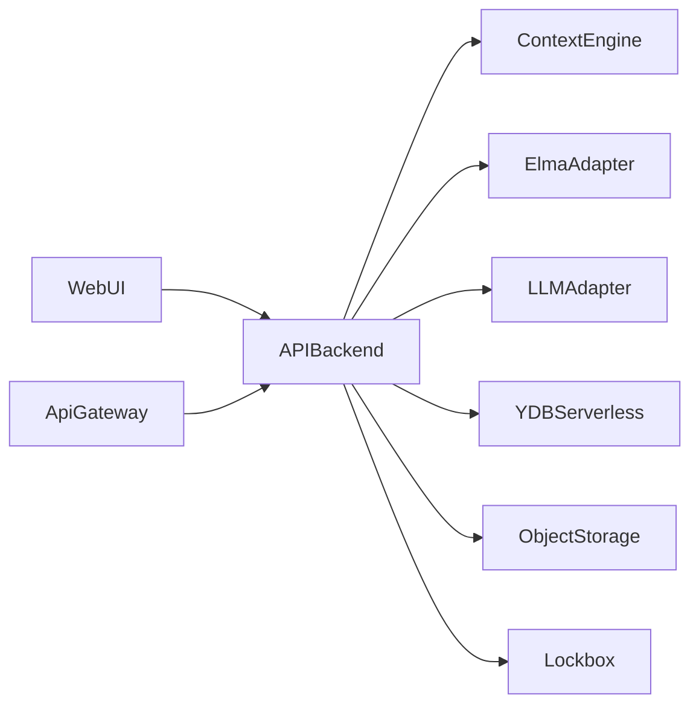

# Meta ELMA GPT Wrapper (v1 prototype)

Product-ready prototype for ELMA365 metadata context chat with user-scoped access model.

## Scope
- ELMA365 Public Web API only.
- Metadata/context-level entities only (no app item business data in v1).
- OpenAI Responses API wrapper.
- Yandex Cloud managed/serverless deployment target.

## Monorepo structure
- `apps/api` - HTTP backend.
- `apps/web` - minimal chat UI.
- `packages/domain` - typed domain contracts.
- `packages/elma-adapter` - ELMA integration layer.
- `packages/context-engine` - context normalization and compacting.
- `packages/llm-adapter` - provider abstraction and OpenAI implementation.
- `packages/storage` - repositories and storage contracts.
- `infra` - Terraform for Yandex Cloud.
- `docs/adr` - architecture decisions.

## Local run
1. Install pnpm.
2. Install dependencies:
   - `pnpm install`
3. Start API:
   - `pnpm dev`
4. Start web UI:
   - `pnpm dev:web`

## Required API endpoints (implemented in skeleton)
- `GET /health`
- `GET /ready`
- `POST /connections`
- `GET /connections`
- `POST /context/refresh`
- `GET /context/current`
- `GET /context/current/compact`
- `POST /chat`
- `GET /chat/sessions`
- `GET /chat/sessions/{id}`
- `GET /debug/prompt/{trace_id}`

## Architecture diagram

## Known v1 limitations
- ELMA adapter and YDB/ObjectStorage persistence are currently scaffolded.
- LLM adapter returns stub response until OpenAI integration is wired.
- Terraform is a baseline and needs full resource wiring (container, gateway, IAM, logs).

## Roadmap
1. Implement ELMA typed endpoints and normalization.
2. Replace in-memory repositories with YDB + Object Storage.
3. Add OpenAI Responses API structured outputs and prompt traces.
4. Add CI/CD and full Terraform deployment.
5. Add test layers: unit/integration/e2e.
